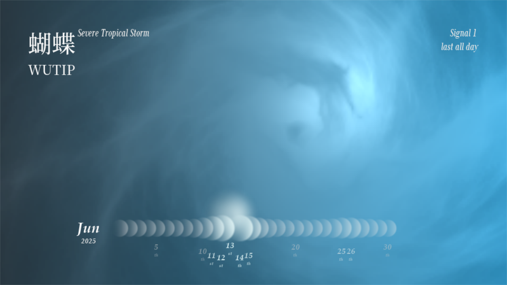

[//]: # (Reference: https://github.com/Rostave/Best-README-Template by othneildrew)
<!-- PROJECT SHIELDS -->
<!--
*** I'm using markdown "reference style" links for readability.
*** Reference links are enclosed in brackets [ ] instead of parentheses ( ).
*** See the bottom of this document for the declaration of the reference variables
*** for contributors-url, forks-url, etc. This is an optional, concise syntax you may use.
*** https://www.markdownguide.org/basic-syntax/#reference-style-links
-->
[![Contributors][contributors-shield]][contributors-url]
[![Issues][issues-shield]][issues-url]
[![Unlicense License][license-shield]][license-url]


<!-- PROJECT LOGO -->
<br />
<div align="center">

  <h3 align="center">SD5913 CREATIVE PROGRAMMING FOR DESIGNERS AND ARTISTS</h3>

  <p align="center">
    Assignment 2 - Data Visulization - Tropical Cyclone Calendar
    <br />
  </p>
</div>


<!-- TABLE OF CONTENTS -->
<details>
  <summary>Table of Contents</summary>
  <ol>
    <li>
      <a href="#about-the-project">About The Project</a>
      <ul>
        <li><a href="#built-with">Built With</a></li>
      </ul>
    </li>
    <li>
      <a href="#getting-started">Getting Started</a>
      <ul>
        <li><a href="#prerequisites">Prerequisites</a></li>
        <li><a href="#installation">Installation</a></li>
      </ul>
    </li>
    <li><a href="#contributing">Contributing</a></li>
    <li><a href="#license">License</a></li>
    <li><a href="#contact">Contact</a></li>
    <li><a href="#acknowledgments">Acknowledgments</a></li>
  </ol>
</details>


<!-- ABOUT THE PROJECT -->
## About The Project




This project is named the **Tropical Cyclone Calendar (TCC)**.

This project visualizes the Tropical Cyclones (TCs) records obtained from the Hong Kong Observatory (HKO). 
This app provides a calendar view of dates of month, the more severe the TC was, the bigger and date nodes are.

In this app, you can:
* **hover your pointer on date nodes** to get a specific view of the TC that day, with the background illustrating
a simple TC simulation. 
* **scroll the mouse middle button** or **press PageUp, PageDown** to switch the month for viewing past records.

<p align="right">(<a href="#readme-top">back to top</a>)</p>


### Built With

* [Python](https://www.python.org)
* [Pygame](https://www.pygame.org/news) for application developing
* [Pygame Shaders](https://github.com/ScriptLineStudios/pygame_shaders) for TC shader visualization


<p align="right">(<a href="#readme-top">back to top</a>)</p>


<!-- GETTING STARTED -->
## Getting Started

You may run the app by following the steps below.

### Prerequisites
  ```sh
  pip install -r requirements.txt
  ```
_Of course you can use other package management tools!_

### Running
```sh
python main.py
```
_Now you may wait for the visualization window to launch. It may take a few seconds to request data online._

If everything goes well, you should see the output in the terminal:
```
[App]    Launched with resolution: (960, 540), FPS: 60
[Data]   Fetching data from HKO...
[Data]   Fetched the latest tropical cyclone records from HKO
```

<p align="right">(<a href="#readme-top">back to top</a>)</p>


<!-- CONTRIBUTING -->
## Contributing

You may see two contributors, both of them are mine. Github makes multi-device development easy!
### Top contributors:

<a href="https://github.com/bitcirno/visual-data-as-art/graphs/contributors">
  
</a>

<p align="right">(<a href="#readme-top">back to top</a>)</p>


<!-- LICENSE -->
## License

Unlicensed currently.

<p align="right">(<a href="#readme-top">back to top</a>)</p>


<!-- CONTACT -->
## Contact

bitCirno (Bilibili) - [@Rostave](https://b23.tv/3oXghzO) - 1637131272@qq.com

Project Link: [https://github.com/bitcirno/visual-data-as-art](https://github.com/bitcirno/visual-data-as-art)

<p align="right">(<a href="#readme-top">back to top</a>)</p>


<!-- ACKNOWLEDGMENTS -->
## Acknowledgments

* [香港天文台](https://www.hko.gov.hk/tc/informtc/tcMain.htm)
* [Pygame](https://www.pygame.org/news)
* [Pygame Shaders](https://github.com/ScriptLineStudios/pygame_shaders)
* [Choose an Open Source License](https://choosealicense.com)
* [GitHub Emoji Cheat Sheet](https://www.webpagefx.com/tools/emoji-cheat-sheet)
* [Img Shields](https://shields.io)
* [GitHub Pages](https://pages.github.com)
* [Font Awesome](https://fontawesome.com)

<p align="right">(<a href="#readme-top">back to top</a>)</p>


<!-- MARKDOWN LINKS & IMAGES -->
<!-- https://www.markdownguide.org/basic-syntax/#reference-style-links -->
[contributors-shield]: https://img.shields.io/github/contributors/bitcirno/visual-data-as-art.svg?style=for-the-badge
[contributors-url]: https://github.com/bitcirno/visual-data-as-art/graphs/contributors
[forks-shield]: https://img.shields.io/github/forks/bitcirno/visual-data-as-art.svg?style=for-the-badge
[forks-url]: https://github.com/bitcirno/visual-data-as-art/network/members
[stars-shield]: https://img.shields.io/github/stars/bitcirno/visual-data-as-art.svg?style=for-the-badge
[stars-url]: https://github.com/bitcirno/visual-data-as-art/stargazers
[issues-shield]: https://img.shields.io/github/issues/bitcirno/visual-data-as-art.svg?style=for-the-badge
[issues-url]: https://github.com/bitcirno/visual-data-as-art/issues
[license-shield]: https://img.shields.io/github/license/bitcirno/visual-data-as-art.svg?style=for-the-badge
[license-url]: https://github.com/bitcirno/visual-data-as-art/blob/master/LICENSE.txt
[linkedin-shield]: https://img.shields.io/badge/-LinkedIn-black.svg?style=for-the-badge&logo=linkedin&colorB=555
[linkedin-url]: https://linkedin.com/in/othneildrew
[product-screenshot]: images/screenshot.png
